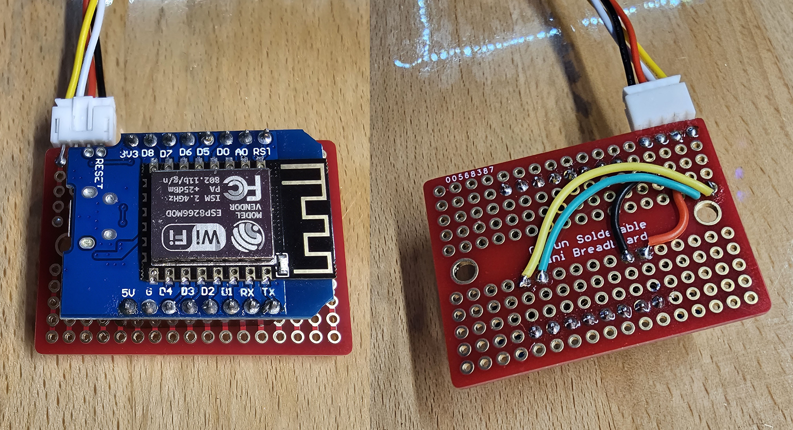

# Mitsubishi AC WiFi Controller with MQTT support


Supported features:
* Web UI
* WiFi with both self-hosted or joining existing access points
* MQTT support
* OTA firmware update using ElegantOTA at `/update`
* 3D printed case for clean and seamless mounting

Based on:
* https://github.com/jaisor/stus-rf24-wifi-gw
* https://github.com/SwiCago/HeatPump

# Usage

## Initial boot / reset

On first boot the device creates a self-hosted WiFi access point (AP) with SSID starting with `ESP8266MHVAC` and WPA2 password `password123`
In self-hosted AP mode, the device gives itself `192.168.4.1` IP address.

The device can be connected to an existing AP using the `/wifi` option


## Resetting / erasing configuration

The device will reset itself to default configuration and self-hosted AP if it unable to complete its boot sequence within 2 seconds (smooth boot) 3 times in a row.
This can be forced by power-cycling the device several times, each time powered up for about 1 second (less than 2 second, but enough for the CPU to start). 

# Programming the ESP8266

Compile and upload the project using USB. After the resistors are removed (see below), future updates will have to be made using OTA. 
Access to OTA is at `/update` path at the device's IP. See Initial boot below on how to connect to the self-hosted AP.

# Assembly

Resources showing how to remove the cover from Mitsubishi HVAC units. It is a bit tricky and intimidating. There are some hidden plastic latches that have to be forced and negotiated a bit.
Turn power to the unit and take any other appropriate precautions. As with all DIY projects, proceed at your own risk. 

* https://chrdavis.github.io/hacking-a-mitsubishi-heat-pump-Part-1/
* https://youtu.be/U0aPWvbfMRA?t=454


## Parts

* ESP8266 Chip ESP-12F style board - https://www.amazon.com/dp/B081PX9YFV/
* PCB dev board - https://www.amazon.com/dp/B0778G64QZ?ref=ppx_yo2ov_dt_b_fed_asin_title
* CN105 connector housing - https://www.digikey.com/en/products/detail/jst-sales-america-inc/PAP-05V-S/759977
* Connector pins - https://www.digikey.com/en/products/detail/jst-sales-america-inc/SPHD-002T-P0.5/608809
* Alternative pre-made CN105 cable - https://www.aliexpress.us/item/3256802718583041.html
* M3 x 4mm bolts for mounting the board in the case - https://www.amazon.com/dp/B08H2HCBQM/
* (Optional) 4 pin connectors so the unit can be disconnected without having to take the HVAC cover off again - https://www.amazon.com/gp/product/B01DUC1S14

## Removing the RX/TX resistors

The RX/TX resistors have to be removed on some variants of the ESP8266 board, like "Wemos D1 Mini" and other similar ones.
Easiest way is to heat them up with a soldering gun, or pry them off with tweezers. 
Keep in mind you will not be able to upload builds via USB anymore, so do this is a final step before connecting to the heat pump.
Future updates will have to happen over OTA


## Wiring

See CN105 pinout here:


Link to source - https://www.geekzone.co.nz/forums.asp?forumid=73&topicid=303958

```
| TX  | - RXD0 / GPIO1
| RX  | - TXD0 / GPIO3
| 5V  | - 5V
| GND | - GND
| 12V | - not connected
```





## Case

3D printable case is available


* [case base](assets/HVACBoxBase.stl)
* [case lid](assets/HVACBoxLid.stl)

# Apache proxy setup

Example configuration for exposing a local network device via Apache proxy. Strong advised to use SSL/HTTPS and other appropriate authentication and authorization controls to prevent bad actors access. 

```
                <Location /ac>
                        AuthType Basic
                        Authname "Password Required"
                        AuthUserFile /etc/apache2/.htpasswd
                        Require valid-user
                </Location>

                ProxyPass /ac/roomname http://192.168.x.y disablereuse=On
                ProxyPassReverse /ac/roomname http://192.168.x.y
```
